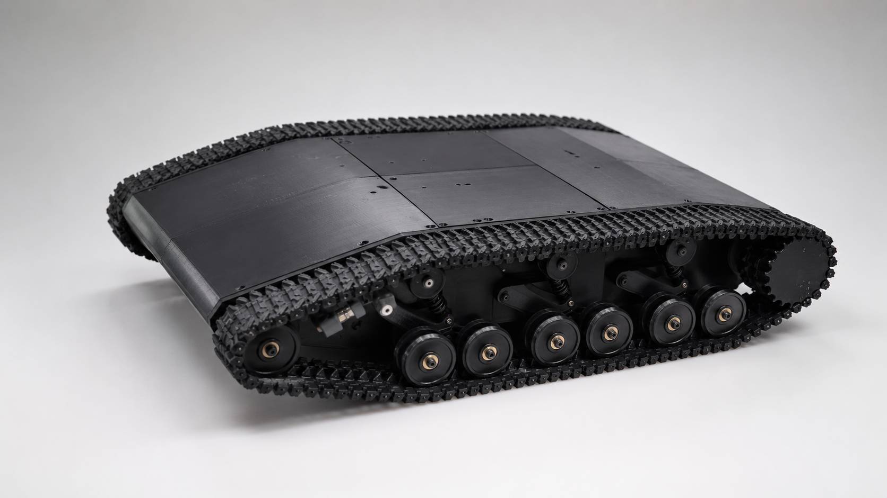
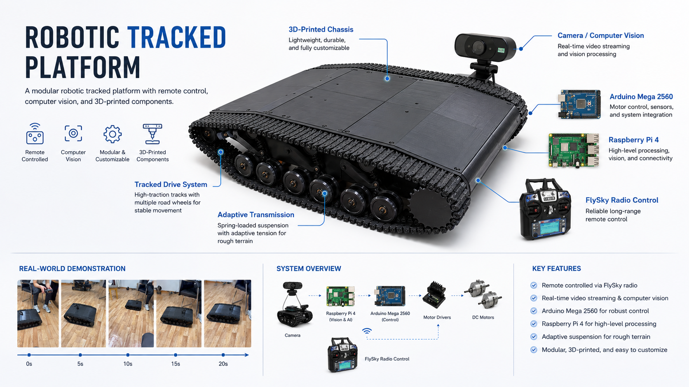
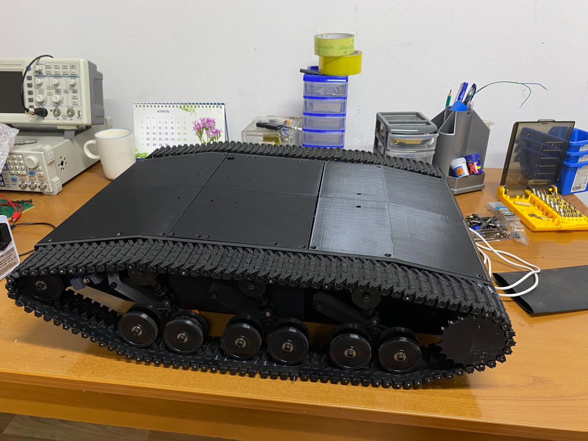

# Robotic Tracked Platform

A modular robotic tracked platform combining **3D-printed mechanical components, Arduino-based motion control, Raspberry Pi computer vision, and FlySky remote control**.

  

## Overview

This project is a remotely controlled robotic tracked platform developed as an engineering graduation project.

The platform combines mechanical design, embedded electronics, radio control, 3D printing, and computer vision in a single robotic system.

### Main technologies

- Arduino Mega 2560
- Raspberry Pi 4
- Python
- OpenCV
- FlySky FS-i6 / FS-iA6B
- BTS7960 motor drivers
- SolidWorks
- 3D printing

## Key Features

- Differential tracked drive
- Remote control via FlySky radio system
- PWM motor speed control
- Emergency stop functionality
- Two-speed transmission
- Raspberry Pi video processing
- OpenCV-based obstacle detection
- 3D-printed modular chassis

## System Overview

  

## Real Prototype

The platform was physically designed, 3D-printed, assembled, programmed, and tested as part of a graduation engineering project.

  

## Demo

A short demonstration of the robotic tracked platform during real-world testing.

▶️ [Watch the platform demonstration](media/platform_demo.mp4)
