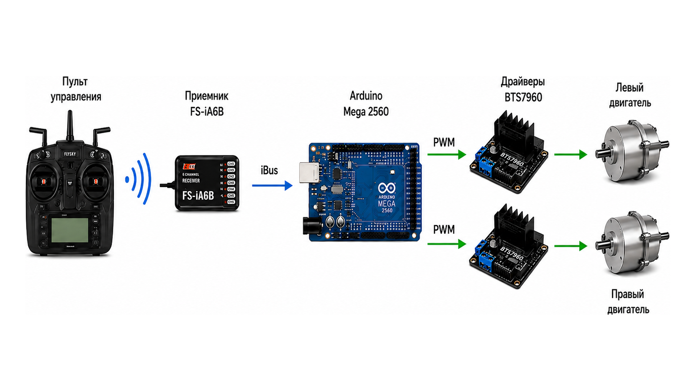
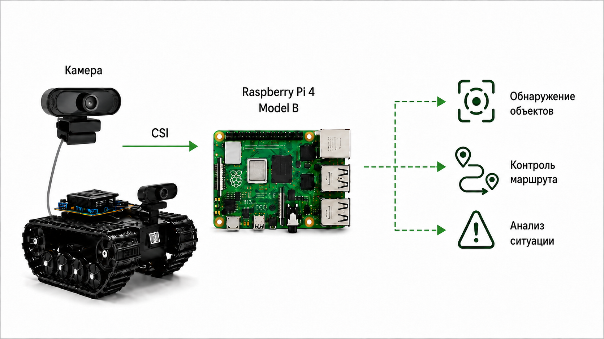
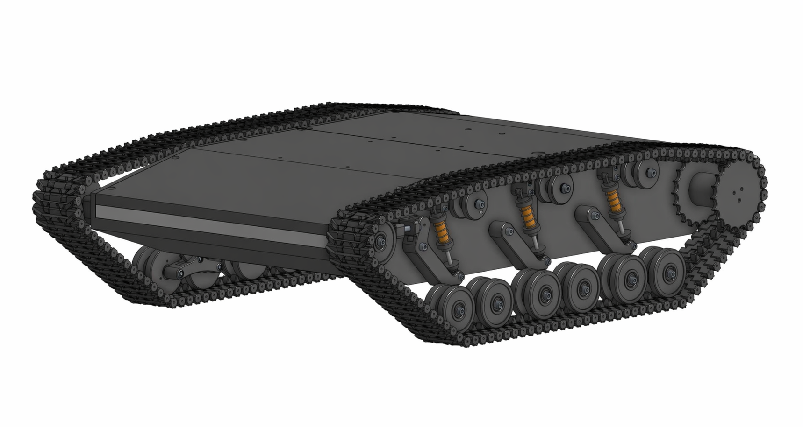
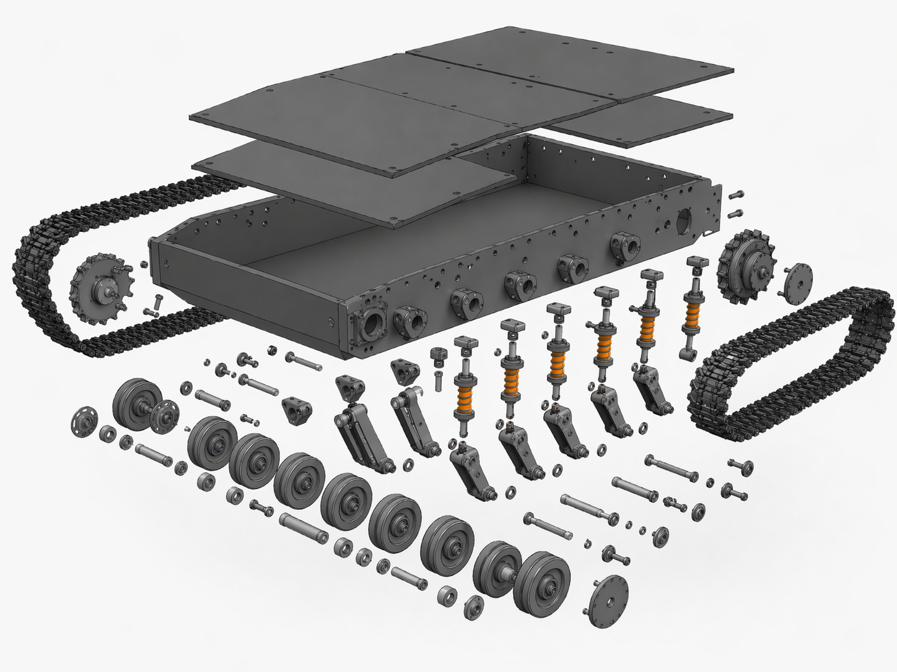

# Robotic Tracked Platform

A modular robotic tracked platform combining **3D-printed mechanical components, Arduino-based motion control, Raspberry Pi computer vision, and FlySky remote control**.

<p align="center">
  
</p>

## Overview

This project presents a remotely controlled robotic tracked platform developed as an engineering graduation project.

The system combines **mechanical design, embedded electronics, radio control, additive manufacturing, and computer vision** within a single mobile robotic platform.

The platform uses an **Arduino Mega 2560** for real-time motion control and a **Raspberry Pi 4** for camera processing and computer vision tasks.

### Main Technologies

* Arduino Mega 2560
* Raspberry Pi 4 Model B
* Python
* OpenCV
* FlySky FS-i6 / FS-iA6B
* BTS7960 motor drivers
* SolidWorks
* FDM 3D printing

## Key Features

* Differential tracked drive
* FlySky radio remote control
* PWM motor speed control
* Smooth acceleration and deceleration
* Emergency stop functionality
* Two-speed transmission
* Raspberry Pi-based video processing
* OpenCV-based obstacle detection
* Modular 3D-printed chassis
* Expandable architecture for future autonomous functions

## Project Overview

<p align="center">
  
</p>

## Real Prototype

The platform was physically **designed, 3D-printed, assembled, programmed, and tested** as part of the engineering project.

<p align="center">
  
</p>

## Demo

A short demonstration of the robotic tracked platform during real-world testing.

▶️ **[Watch the platform demonstration](media/platform_demo.mp4)**

---

## System Architecture

The robotic platform uses a two-level architecture that separates real-time motion control from higher-level video processing.

<p align="center">
  
</p>

### Low-Level Control — Arduino Mega 2560

The **Arduino Mega 2560** is responsible for real-time interaction with the drive system.

Main functions include:

* Receiving commands from the FlySky FS-iA6B receiver via iBus
* Processing throttle and steering input
* Generating PWM signals for the BTS7960 motor drivers
* Controlling the left and right DC motors
* Differential steering
* Motor speed control
* Smooth acceleration and deceleration
* Emergency stop and safety logic
* Transmission mode control

### Control Chain

`FlySky FS-i6 → FS-iA6B → Arduino Mega 2560 → BTS7960 → DC Motors`

### High-Level Processing — Raspberry Pi 4

The **Raspberry Pi 4 Model B** provides additional computing power for camera processing and computer vision.

<p align="center">
  
</p>

Main functions include:

* Capturing video from the camera
* Processing frames using Python and OpenCV
* Image preprocessing
* HSV-based segmentation
* Edge detection
* Contour detection
* Basic obstacle detection
* Bounding-box visualization
* Real-time monitoring
* Providing a software foundation for future autonomous navigation

### Vision Processing Chain

`Camera → Raspberry Pi 4 → Python / OpenCV → Obstacle Detection`

---

## Hardware

The platform integrates mechanical, electronic, radio-control, and computing components into a single robotic system.

### Main Components

* Arduino Mega 2560
* Raspberry Pi 4 Model B
* FlySky FS-i6 transmitter
* FlySky FS-iA6B receiver
* BTS7960 motor drivers
* DC motors
* Camera
* Battery power system
* Servos
* Custom electronic control module
* 3D-printed chassis
* Tracked drive components
* Two-speed transmission

The Arduino Mega 2560 handles real-time motion control, while the Raspberry Pi 4 is used for video processing and computer vision.

---

## CAD & 3D Printing

The mechanical structure of the robotic platform was designed using **SolidWorks**.

<p align="center">
  
</p>

The CAD development included:

* Chassis design
* Tracked drive system
* Suspension components
* Mounting elements
* Internal component layout
* Transmission components
* Assembly verification
* Preparation of parts for manufacturing

### Exploded CAD View

<p align="center">
  
</p>

The platform was designed with additive manufacturing in mind. Most structural components were manufactured using **FDM 3D printing**.

3D printing made it possible to rapidly prototype, modify, and manufacture custom mechanical components specifically for the robotic platform.

---

## Software

The software architecture is divided into two main components: **Arduino firmware** and **Raspberry Pi computer vision software**.

### Arduino Firmware

The Arduino Mega 2560 firmware is responsible for real-time control of the tracked drive system.

Main functions include:

* Reading FlySky receiver commands via iBus
* Processing throttle and steering input
* PWM motor speed control
* Differential steering
* Smooth acceleration and deceleration
* Emergency stop / safety logic
* Tracked drive control

**Source code:**

[`src/arduino/tracked_platform_control.ino`](src/arduino/tracked_platform_control.ino)

### Raspberry Pi Computer Vision

The Raspberry Pi software is written in **Python** and uses **OpenCV** for image processing.

Main functions include:

* Camera initialization
* Real-time video capture
* Image preprocessing
* HSV-based image segmentation
* Edge detection
* Contour detection
* Basic obstacle detection
* Bounding-box visualization
* FPS monitoring

**Source code:**

[`src/raspberry_pi/obstacle_detection.py`](src/raspberry_pi/obstacle_detection.py)

**Python dependencies:**

[`src/raspberry_pi/requirements.txt`](src/raspberry_pi/requirements.txt)

---

## Repository Structure

```text
robotic-tracked-platform/
│
├── README.md
│
├── images/
│   ├── platform_hero.png
│   ├── platform_infographic.png
│   ├── platform_real.jpg
│   ├── cad_model.png
│   ├── cad_exploded_view.png
│   ├── control_architecture.png
│   └── computer_vision_architecture.png
│
├── media/
│   └── platform_demo.mp4
│
└── src/
    ├── arduino/
    │   └── tracked_platform_control.ino
    │
    └── raspberry_pi/
        ├── obstacle_detection.py
        └── requirements.txt
```

---

## Future Improvements

The current platform provides a foundation for further development.

Possible improvements include:

* Autonomous navigation
* Advanced obstacle avoidance
* Machine-learning-based object detection
* Visual object tracking
* Ultrasonic sensor integration
* LiDAR integration
* Telemetry transmission
* Remote web-based control
* Raspberry Pi ↔ Arduino communication
* Automatic route planning
* Improved power management
* Semi-autonomous operating modes

---

## Author

**Adilkhan Bazarkhanov**

Instrumentation Engineering graduate with interests in:

* Robotics
* Embedded systems
* Computer vision
* Internet of Things
* 3D printing
* CAD design
* Electronics
* Python development

This repository was created and is maintained by **Adilkhan Bazarkhanov** as an engineering portfolio project.

---

## Academic Project

This repository presents the engineering implementation of a graduation project completed in **2026**.

The repository is maintained as a technical portfolio demonstrating practical experience in:

* Robotic system development
* Embedded programming
* Mechanical design
* CAD modelling
* Additive manufacturing
* Electronics integration
* Radio control systems
* Python and OpenCV
* Arduino development
* Raspberry Pi development
